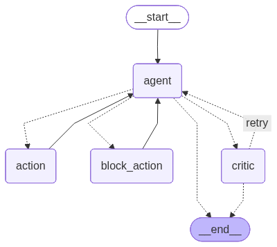
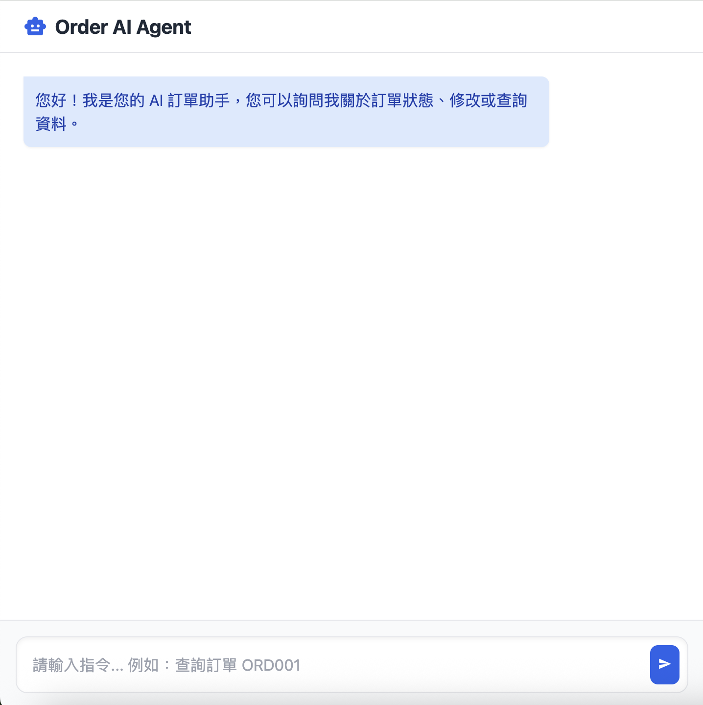

# Order AI Agent

## 專案描述

Order AI Agent 是一個基於 LangChain 和 LangGraph 的智慧訂單管理代理系統。系統整合了 Google Gemini AI 模型，提供自動化的訂單查詢、修改和取消功能。透過 FastAPI 後端 API 和簡潔的網頁介面，用戶可以輕鬆與 AI 助手進行互動，管理訂單資料。

## 專案性質與限制

**本專案主要作為學習與練習 LangGraph 與 LangChain 流程架構設計之用**，並非生產級應用。以下為關鍵設計考量與限制：

- **架構重點**：專注於展示多代理協作流程、條件路由邏輯及狀態管理機制，驗證複雜工作流程的實現可行性。
- **資料儲存**：採用記憶體字典作為資料儲存媒介，未整合持久化資料庫或外部儲存服務。資料在應用重啟後將遺失，僅供概念驗證使用。
- **適用場景**：適合用於技術學習、原型開發及架構設計研究，不建議直接部署至生產環境。
- **擴展建議**：實際應用應考慮整合關係型資料庫（如 PostgreSQL）、快取機制及錯誤處理強化。

## 主要功能

- **訂單查詢**：根據訂單編號查詢詳細資訊
- **訂單修改**：更新訂單數量或配送地址
- **訂單取消**：取消指定訂單
- **智慧對話**：支援自然語言互動，自動理解用戶意圖
- **狀態檢查**：防止對已出貨或已取消訂單進行不當操作
- **糾錯機制**：內建批評代理，確保回應準確性

## 技術架構

### 核心組件

- **LangChain**: 用於建構 AI 代理和工具鏈
- **LangGraph**: 實現複雜的工作流程圖
- **Google Gemini AI**: 提供強大的語言理解能力
- **FastAPI**: 提供 RESTful API 介面
- **Web 介面**: 基於 Tailwind CSS 的聊天介面

### Agent 架構流程

系統採用 LangGraph 建構的狀態機架構，主要包含以下節點：

1. **Agent 節點**: 主要 AI 模型，負責理解用戶輸入並決定下一步動作
2. **Action 節點**: 執行具體的訂單操作工具
3. **Block Action 節點**: 攔截不允許的操作（如修改已出貨訂單）
4. **Critic 節點**: 批評和糾錯機制，確保回應品質

工作流程圖如下 ：





圖中展示了各節點間的條件邊緣和路由邏輯，確保系統能夠智能地處理各種訂單管理場景。

## Demo




## 安裝說明

### 環境需求

- Python 3.10+
- Google Cloud API 金鑰（用於 Gemini AI）

### 安裝步驟

1. 安裝套件：
```bash
pip install -r requirements.txt
```

2. 設定環境變數：
```bash
export GOOGLE_API_KEY="your-google-api-key-here"
```

## 使用說明

### 本地運行

啟動服務：
```bash
python main.py
```

服務將在 `http://localhost:8080` 啟動。

### API 使用

#### 聊天介面
訪問 `http://localhost:8080` 進入網頁聊天介面。

#### REST API
發送 POST 請求到 `/chat` 端點：

```json
{
  "message": "查詢訂單 ORD001",
  "session_id": "user123"
}
```

回應格式：
```json
{
  "answer": "訂單 ORD001 資訊：{'item': 'iPhone 15', 'status': '已出貨', 'quantity': 1, 'address': '台北市信義區'}",
  "session_id": "user123",
  "current_db": {...}
}
```

### 範例互動

- 查詢訂單：`查詢訂單 ORD001`
- 更新數量：`將訂單 ORD002 的數量改為 3`
- 更新地址：`修改訂單 ORD002 的地址為新北市板橋區`
- 取消訂單：`取消訂單 ORD003`

## 專案結構

```
order-manager-ai/
├── main.py                 # FastAPI 應用主程式
├── requirements.txt        # Python 依賴套件
├── agents/                 # AI 代理相關
│   ├── models.py           # AI 模型配置
│   └── critic.py           # 批評代理
├── data/                   # 資料層
│   └── order_db.py         # 訂單資料庫
├── graph/                  # LangGraph 工作流程
│   ├── workflow.py         # 主要工作流程
│   ├── state.py            # 狀態定義
│   └── nodes.py            # 圖節點
├── static/                 # 靜態資源
│   └── index.html          # 網頁介面
└── tools/                  # 工具函數
    └── order_tools.py      # 訂單操作工具
```
